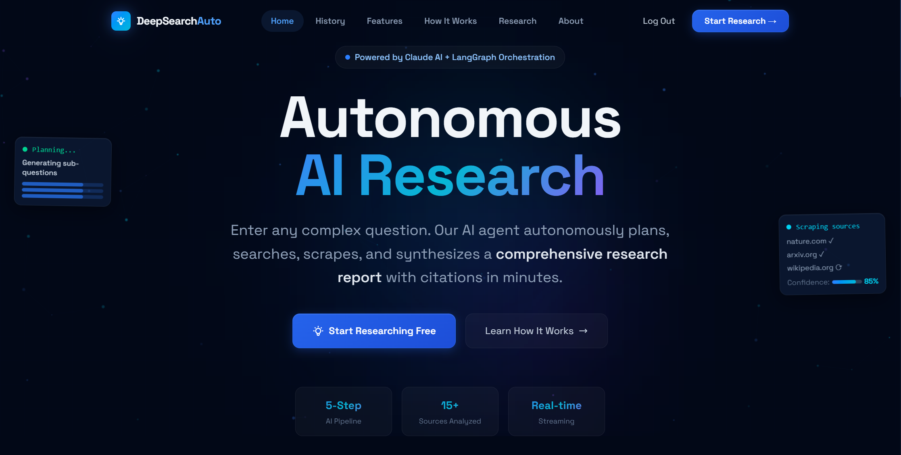
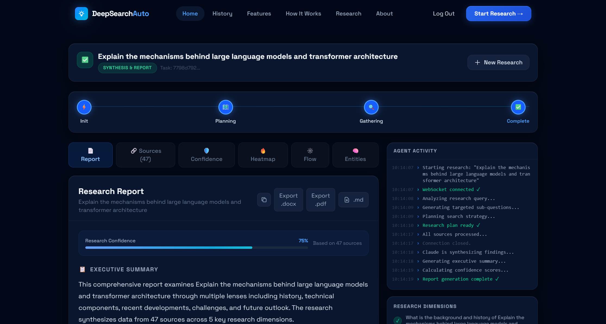
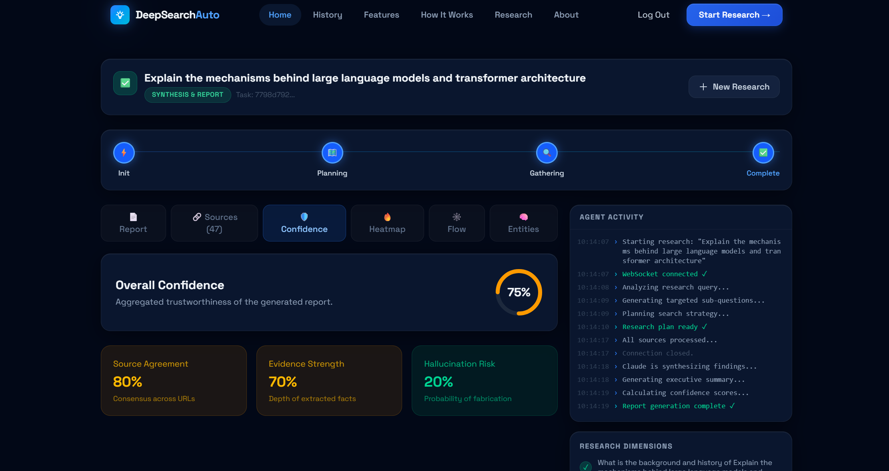
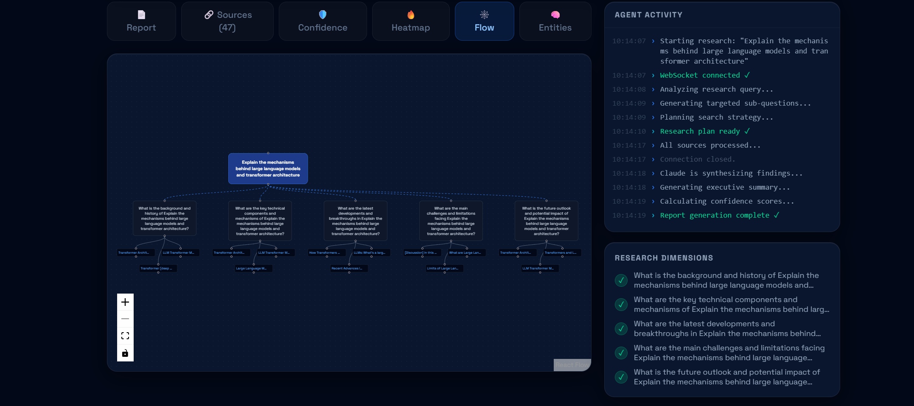
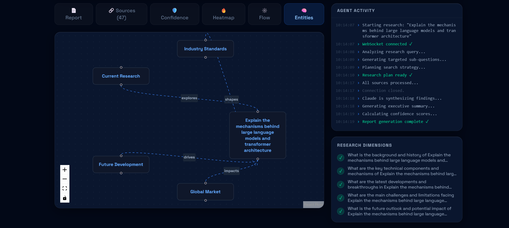
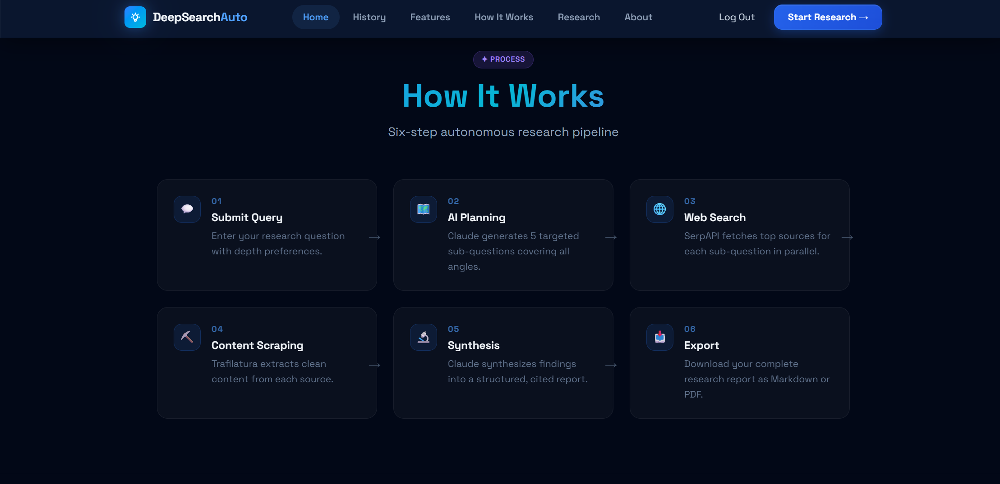

# 🔬 DeepSearch Auto - Autonomous Research Agent  

<div align="center">

**An enterprise-grade autonomous AI research platform that replicates the deep-research capabilities of commercial tools like Perplexity AI — fully open-source and self-hostable.**

[](https://fastapi.tiangolo.com)
[](https://nextjs.org)
[](https://langchain-ai.github.io/langgraph/)
[](https://anthropic.com)
[](LICENSE)

[Live Demo](https://deepsearch-auto.vercel.app) · [Backend API](https://deepsearchauto-autonomous-research-agent.onrender.com/api/health) · [Report Bug](https://github.com/your-repo/issues) · [Request Feature](https://github.com/your-repo/issues)

</div>

## 🏠 Landing Page



---

## 📋 Table of Contents

- [Overview](#-overview)
- [Key Features](#-key-features)
- [Technology Stack](#️-technology-stack)
- [Architecture](#-architecture--how-it-works)
- [Project Structure](#-project-structure)
- [Local Setup](#️-local-setup)
- [Environment Variables](#-environment-variables)
- [Deployment Guide](#-deployment-guide)
- [API Reference](#-api-reference)
- [Visualizations Deep Dive](#-visualizations-deep-dive)
- [Authentication](#-authentication)
- [Troubleshooting](#-troubleshooting)
- [Contributing](#-contributing)
- [License](#-license)

---

## 🌟 Overview

DeepSearch Auto is a full-stack AI research platform that automates the entire research workflow. You submit a question; the system autonomously plans a research strategy, executes parallel web searches, scrapes and cleans source content, and uses Claude AI to synthesize a fully cited, structured research report — all in real time.

Think of it as your personal AI research analyst: it doesn't just search, it *thinks*, *reads*, and *writes* like a human researcher.

### What makes it different?

| Feature | Basic AI Chat | DeepSearch Auto |
|---|---|---|
| Research Planning | ❌ Manual | ✅ Autonomous sub-question generation |
| Web Access | ❌ Static training data | ✅ Live SerpAPI web search |
| Content Extraction | ❌ None | ✅ Full page scraping via Trafilatura |
| Multi-source Synthesis | ❌ Single prompt | ✅ Parallel multi-source synthesis |
| Real-time Progress | ❌ None | ✅ WebSocket live streaming |
| Visualizations | ❌ None | ✅ Knowledge graph, heatmap, confidence dashboard |
| Export | ❌ Copy/paste | ✅ Markdown, PDF, DOCX |

---

## 📑 Research Report Dashboard



## 📊 Confidence Analysis



## 🚀 Key Features

### Core Research Engine
- **🧠 Autonomous AI Planning** — LangGraph + Claude automatically decomposes complex queries into 5 targeted, angle-covering sub-questions without any manual input.
- **🔍 Parallel Web Search** — SerpAPI fetches top results for every sub-question simultaneously using `asyncio.gather`, dramatically reducing research time.
- **📄 Smart Content Extraction** — Trafilatura scrapes full page content, stripping ads, navbars, and boilerplate to deliver only clean, readable text.
- **✅ Fact Cross-Referencing** — Claims are validated across multiple independent sources to reduce hallucinations and surface consensus.
- **📝 AI-Synthesized Reports** — Claude synthesizes all gathered context into professional executive summaries, per-question answers, and conclusions.

### Real-Time Experience
- **⚡ WebSocket Streaming** — A persistent WebSocket connection (`/api/research/stream/{taskId}`) pushes live progress updates from the backend to the UI as the agent moves through each pipeline stage.
- **🔄 HTTP Polling Fallback** — If the WebSocket connection drops, the frontend automatically falls back to polling `/api/research/status/{taskId}` every 2 seconds — no data loss, no user friction.
- **📊 Live Stage Indicators** — The UI shows real-time stage progression: Init → Planning → Gathering → Synthesizing → Complete.

### Visualizations
- **🕸️ Interactive Citation Graph** — A node-based React Flow graph shows the hierarchical relationship between the main query, sub-topics, and individual scraped sources. Nodes are draggable and zoomable.
- **🧠 Knowledge Graph** — AI extracts named entities and their relationships (e.g., "OpenAI *acquired* Rockset") and renders them as an interactive force-directed network.
- **🔥 Topic Intensity Heatmap** — The top 10 concepts extracted from all sources are displayed as color-coded, size-scaled interactive pills — bigger and redder = more prominent.
- **📈 Confidence Dashboard** — Animated SVG radial progress bars display real-time trust metrics: Source Agreement, Evidence Strength, and Hallucination Risk scores (all 0.0–1.0).

### Export & History
- **📥 Professional Exports** — Download completed reports in three formats: Markdown (for developers), PDF (for sharing), and DOCX (for editing in Word).
- **⏳ Session History** — All research sessions in your active browser session are saved locally, accessible from the sidebar for instant reference.

---

## 🛠️ Technology Stack

### Backend

| Layer | Technology | Purpose |
|---|---|---|
| Framework | FastAPI 0.115 | REST API + WebSocket server |
| AI Orchestration | LangGraph 0.2 | Stateful multi-step agent pipeline |
| LLM Provider | LangChain-Anthropic + Claude Haiku | Planning, synthesis, extraction |
| Web Search | SerpAPI | Google search results via API |
| Web Scraping | Trafilatura 1.12 | Clean content extraction from URLs |
| Async Runtime | Python Asyncio + Uvicorn | Concurrent pipeline execution |
| PDF Export | ReportLab | Programmatic PDF generation |
| DOCX Export | python-docx | Word document generation |
| HTTP Client | httpx 0.27.2 | Async HTTP requests |
| Env Management | python-dotenv | Local environment variables |

### Frontend

| Layer | Technology | Purpose |
|---|---|---|
| Framework | Next.js 15 (App Router) | SSR + client-side rendering |
| Language | TypeScript | Type-safe component development |
| Styling | TailwindCSS | Utility-first responsive design |
| Animations | Framer Motion | Page transitions + micro-interactions |
| Graph Viz | React Flow | Interactive citation + knowledge graphs |
| Auth | React Hooks + LocalStorage | Client-side session management |
| WebSocket | Native browser WebSocket API | Real-time pipeline updates |

### Infrastructure

| Service | Platform | Notes |
|---|---|---|
| Backend API | Render | Auto-deploys from GitHub, managed env vars |
| Frontend | Vercel | Edge-optimized Next.js deployment |

---

## 🏗️ Architecture & How It Works

```
User submits query
        │
        ▼
┌─────────────────────────────────────────────────────────────────────┐
│                        FRONTEND (Next.js / Vercel)                  │
│                                                                     │
│  ResearchForm ──POST /api/research/start──► Backend                 │
│       │                                        │                    │
│       │◄──── taskId ───────────────────────────┘                    │
│       │                                                             │
│  ResearchDashboard ◄──── WebSocket /api/research/stream/{taskId}    │
│       │           (falls back to HTTP polling if WS fails)          │
│       │                                                             │
│  Renders: CitationGraph │ KnowledgeGraph │ Heatmap │ Confidence     │
└─────────────────────────────────────────────────────────────────────┘
                              │ WebSocket / HTTP
                              ▼
┌─────────────────────────────────────────────────────────────────────┐
│                       BACKEND (FastAPI / Render)                    │
│                                                                     │
│  POST /api/research/start                                           │
│       │                                                             │
│       ▼                                                             │
│  LangGraph StateGraph ──► [plan] ──► [search_and_scrape] ──► [synthesize]
│                                                                     │
│  [plan]:                                                            │
│    Claude generates 5 targeted sub-questions from the main query    │
│                                                                     │
│  [search_and_scrape]:   (all parallel via asyncio.gather)           │
│    For each sub-question:                                           │
│      SerpAPI ──► Top 3 URLs                                         │
│      Trafilatura ──► Scrape & clean each URL                        │
│                                                                     │
│  [synthesize]:                                                      │
│    Claude writes: executive summary, per-question answers,          │
│    conclusion, keywords, entity relationships, confidence metrics   │
│                                                                     │
│  Results stored in-memory; WebSocket broadcasts each stage update   │
└─────────────────────────────────────────────────────────────────────┘
```

### Pipeline Stages

| Stage | Status Key | What Happens |
|---|---|---|
| 1 | `started` | Task created, background job queued |
| 2 | `planning` | Claude generates 5 sub-questions |
| 3 | `gathered_data` | Parallel search + scrape across all sub-questions |
| 4 | `completed` | Claude synthesizes full report with visualizations data |
| — | `failed` | Error captured, message surfaced to UI |

---

## 🕸️ Research Flow Visualization



---

## 🧩 Entity Relationship Graph



---

## ⚙️ How It Works



## 📂 Project Structure

```
AI_Web_Research_Agent/
├── backend/
│   ├── agents/
│   │   ├── __init__.py
│   │   └── researcher.py        # LangGraph pipeline: plan → search → synthesize
│   ├── models/
│   │   ├── __init__.py
│   │   └── schema.py            # Pydantic models: ResearchRequest, Report, Source, etc.
│   ├── tools/
│   │   ├── search.py            # SerpAPI web search integration
│   │   └── scraper.py           # Trafilatura async content extractor
│   ├── venv/                    # Python virtual environment (local only)
│   ├── .env                     # Local secrets (never committed)
│   ├── .env.example             # Template for required env vars
|   ├── .python-version          # Python version: python-3.11.9(for render)
│   ├── debug_test.py            # Manual pipeline testing script
│   ├── Dockerfile               # Container definition for Render
│   ├── export_utils.py          # PDF + DOCX generation logic
│   ├── main.py                  # FastAPI app: routes, CORS, WebSocket, task runner
│   ├── Procfile                 # Render start command: python main.py
│   ├── requirements.txt         # Pinned Python dependencies
│   ├── runtime.txt              # Python version: python-3.11.9
│   └── test_graph.py            # LangGraph unit tests
│
├── frontend/
│   ├── src/
│   │   ├── app/
│   │   │   ├── about/
│   │   │   │   └── page.tsx     # About page
│   │   │   ├── history/         # Session history page
│   │   │   ├── favicon.ico
│   │   │   ├── globals.css      # Global styles + TailwindCSS base
│   │   │   ├── icon.png
│   │   │   └── layout.tsx       # Root layout with Navbar/Footer
│   │   │   └── page.tsx         # Home page: HeroSection + ResearchForm + Dashboard
│   │   └── components/
│   │       ├── Auth.tsx              # Login/signup modal (localStorage-based)
│   │       ├── CitationGraph.tsx     # React Flow citation node graph
│   │       ├── ConfidenceDashboard.tsx # SVG radial confidence metrics
│   │       ├── Footer.tsx
│   │       ├── HeroSection.tsx       # Landing hero with animated stats
│   │       ├── KnowledgeGraph.tsx    # React Flow entity relationship graph
│   │       ├── Navbar.tsx            # Responsive navigation bar
│   │       ├── ResearchDashboard.tsx # Main results container + WebSocket client
│   │       ├── ResearchForm.tsx      # Query input + depth/source selectors
│   │       └── ResearchHeatmap.tsx   # Topic intensity keyword heatmap
│   ├── .env.local               # Local frontend env (never committed)
│   ├── .env.local.example       # Template for frontend env vars
│   ├── Dockerfile               # Frontend container (optional)
│   ├── next.config.js           # Next.js config: standalone output, API URL
│   ├── package.json
│   ├── postcss.config.mjs
│   └── tsconfig.json
│
├── docker-compose.yml           # Local full-stack Docker setup
├── .gitignore
└── README.md
```

---

## ⚙️ Local Setup

### Prerequisites

- Python 3.11+
- Node.js 18+
- A free [Anthropic API key](https://console.anthropic.com)
- *(Optional)* A [SerpAPI key](https://serpapi.com) — mock search results are used if not provided

### 1. Clone the Repository

```bash
git clone https://github.com/your-username/AI_Web_Research_Agent.git
cd AI_Web_Research_Agent
```

### 2. Backend Setup

```bash
cd backend

# Create and activate virtual environment
python -m venv venv

# Windows
venv\Scripts\activate

# macOS / Linux
source venv/bin/activate

# Install dependencies (inside venv)
pip install -r requirements.txt
```

Create your `.env` file:

```bash
cp .env.example .env
```

Edit `.env` and fill in your keys (see [Environment Variables](#-environment-variables)).

Start the backend:

```bash
# Make sure venv is still active
python main.py
```

The API will be live at **http://localhost:8000**. Test it:

```bash
curl http://localhost:8000/api/health
# {"status": "ok", "version": "1.0.0"}
```

### 3. Frontend Setup

Open a **new terminal**:

```bash
cd frontend

# Install Node dependencies
npm install

# Create local env file
cp .env.local.example .env.local
```

Edit `.env.local`:

```env
NEXT_PUBLIC_API_URL=http://localhost:8000
```

Start the frontend dev server:

```bash
npm run dev
```

The app will be at **http://localhost:3000**.

### 4. Docker (Optional — Full Stack)

Run both services together with Docker Compose:

```bash
# From project root
docker-compose up --build
```

- Frontend: http://localhost:3000
- Backend: http://localhost:8000

---

## 🔐 Environment Variables

### Backend (`backend/.env`)

| Variable | Required | Description |
|---|---|---|
| `ANTHROPIC_API_KEY` | ✅ Yes | Your Claude API key from [console.anthropic.com](https://console.anthropic.com) |
| `SERPAPI_KEY` | ⚠️ Optional | SerpAPI key for real Google search. If missing, mock results are used instead. Get one at [serpapi.com](https://serpapi.com) |
| `ALLOWED_ORIGINS` | ✅ For prod | Comma-separated list of allowed frontend origins. Example: `https://your-app.vercel.app` |
| `PORT` | Auto | Set automatically by Render. Defaults to `8000` locally. |

```env
# backend/.env
ANTHROPIC_API_KEY=sk-ant-api03-...
SERPAPI_KEY=abc123...                          # optional
ALLOWED_ORIGINS=http://localhost:3000          # comma-separate for multiple
```

### Frontend (`frontend/.env.local`)

| Variable | Required | Description |
|---|---|---|
| `NEXT_PUBLIC_API_URL` | ✅ Yes | Full URL of the backend API. No trailing slash. |

```env
# frontend/.env.local
NEXT_PUBLIC_API_URL=http://localhost:8000
```

> ⚠️ **Never commit `.env` or `.env.local` files.** They are already in `.gitignore`.

---

## 🚀 Deployment Guide

### Backend → Render

1. **Push your code to GitHub** (backend folder must be in the repo).

2. Go to [render.com](https://render.com) → **New Web Service** → select your repo.

3. In **Settings → Root Directory**, set it to `backend` (if your repo contains both frontend and backend).

4. In **Settings → Start Command**, enter:
   ```
   python main.py
   ```
   This lets Python resolve `$PORT` at runtime — avoid using `$PORT` directly in shell commands on Render.

5. Go to **Environment Variables** tab and add:

   | Key | Value |
   |---|---|
   | `ANTHROPIC_API_KEY` | `sk-ant-...` |
   | `SERPAPI_KEY` | your SerpAPI key (optional) |
   | `ALLOWED_ORIGINS` | `https://your-app.vercel.app` |

6. Render will build and deploy automatically. Copy your public URL, e.g.:
   ```
   https://deepsearchauto-autonomous-research-agent.onrender.com
   ```

7. Verify the deployment:
   ```bash
   curl https://deepsearchauto-autonomous-research-agent.onrender.com/api/health
   ```

---

### Frontend → Vercel

1. **Push your frontend folder to GitHub** (can be same repo).

2. Go to [vercel.com](https://vercel.com) → **New Project** → Import your GitHub repo.

3. In **Framework Preset**, Vercel auto-detects Next.js.

4. In **Root Directory**, set `frontend` if your repo has both services.

5. Under **Environment Variables**, add:

   | Key | Value |
   |---|---|
   | `NEXT_PUBLIC_API_URL` | `https://deepsearchauto-autonomous-research-agent.onrender.com` |

6. Click **Deploy**. Vercel builds and publishes your app.

---

### ⚠️ Critical Post-Deploy Checks

**1. CORS** — Your Render backend must have `ALLOWED_ORIGINS` set to your exact Vercel URL:
```
ALLOWED_ORIGINS=https://deepsearch-auto.vercel.app
```
If you use a custom domain, add that too (comma-separated).

**2. WebSocket URL** — Your frontend WebSocket connection must use `wss://` (not `ws://`) for HTTPS deployments. In `ResearchDashboard.tsx`, ensure you have:
```ts
const API_URL = process.env.NEXT_PUBLIC_API_URL || "http://localhost:8000";
const WS_URL = API_URL.replace(/^http/, "ws"); // converts https → wss automatically
const ws = new WebSocket(`${WS_URL}/api/research/stream/${taskId}`);
```

**3. Render PORT** — Do NOT use `$PORT` in shell commands (Render doesn't expand it). Use `python main.py` and let `main.py` read `os.getenv("PORT", 8000)` itself.

---

## 📡 API Reference

Base URL: `https://deepsearchauto-autonomous-research-agent.onrender.com`

### `POST /api/research/start`

Start a new research task.

**Request Body:**
```json
{
  "query": "Explain the mechanisms behind large language models",
  "depth": "standard",
  "source_type": "all"
}
```

| Field | Type | Options | Description |
|---|---|---|---|
| `query` | string | — | The research question |
| `depth` | string | `standard`, `deep` | Research depth level |
| `source_type` | string | `all`, `academic`, `news` | Filter source types |

**Response:**
```json
{
  "task_id": "550e8400-e29b-41d4-a716-446655440000",
  "message": "Research started successfully"
}
```

---

### `GET /api/research/status/{task_id}`

Poll the current task status.

**Response:**
```json
{
  "status": "gathered_data",
  "state": {
    "status": "gathered_data",
    "sub_questions": [
      {
        "question": "What is the background and history of LLMs?",
        "status": "completed",
        "sources": [...],
        "answer": null
      }
    ]
  }
}
```

---

### `GET /api/research/result/{task_id}`

Retrieve the completed research report.

**Response:** Full `ResearchReport` object including:
- `query` — original query
- `executive_summary` — 3-4 paragraph synthesis
- `sub_topics` — array of sub-questions with answers and sources
- `conclusion` — 2-paragraph conclusion
- `overall_confidence` — float 0.0–1.0
- `keywords` — array of `{keyword, intensity, category}`
- `relationships` — array of `{source, target, label}`
- `metrics` — `{overall, source_agreement, evidence_strength, hallucination_risk}`

---

### `WebSocket /api/research/stream/{task_id}`

Real-time pipeline updates.

**Message format:**
```json
{
  "status": "gathered_data",
  "data": {
    "status": "gathered_data",
    "sub_questions": [...],
    "report": null
  }
}
```

---

### `GET /api/research/export/pdf/{task_id}`

Download report as PDF. Returns `application/pdf` stream.

### `GET /api/research/export/docx/{task_id}`

Download report as DOCX. Returns `application/vnd.openxmlformats-officedocument.wordprocessingml.document` stream.

### `GET /api/health`

Health check. Returns `{"status": "ok", "version": "1.0.0"}`.

---

## 📊 Visualizations Deep Dive

### 🕸️ Citation Graph (`CitationGraph.tsx`)

Built with React Flow. Renders a three-tier node hierarchy:
- **Root node** — the main research query (center)
- **Sub-topic nodes** — the 5 AI-generated sub-questions (inner ring)
- **Source nodes** — scraped URLs attached to each sub-topic (outer ring)

Nodes are color-coded by tier and fully interactive — drag, zoom, and pan to explore the source network.

### 🧠 Knowledge Graph (`KnowledgeGraph.tsx`)

The synthesis stage uses Claude to extract named entity relationships (e.g., organizations, people, products) and their connections. These are plotted as a circular force-directed React Flow graph. Use case: instantly see which companies, technologies, or concepts are most interconnected in your research topic.

### 🔥 Topic Heatmap (`ResearchHeatmap.tsx`)

Claude assigns each extracted keyword an intensity score (1–100) and a category (Primary, Context, Analysis). These are rendered as scaling, color-coded pills — higher intensity = larger size and warmer color. Lets you see the "heat map" of a topic at a glance.

### 📈 Confidence Dashboard (`ConfidenceDashboard.tsx`)

Animated SVG radial progress bars show four trust metrics produced by Claude during synthesis:

| Metric | Description |
|---|---|
| Overall Confidence | Aggregate report reliability |
| Source Agreement | How consistent findings are across sources |
| Evidence Strength | Quality and depth of scraped content |
| Hallucination Risk | Estimated likelihood of fabricated claims |

All scores range from 0.0 to 1.0. Red = risky, green = reliable.

---

## 🔒 Authentication

The platform uses a **LocalStorage-based simulated auth** mechanism. This is intentionally lightweight — it gates UI access without requiring a backend database or OAuth setup.

- Click **Sign Up** on the homepage to register with any username/password.
- Credentials are stored in `localStorage` (client-side only — nothing is sent to a server).
- Once logged in, the research form unlocks.
- Session persists across browser refreshes until you log out.

> ⚠️ This is a **demo auth system**. For production with real user data, replace it with NextAuth.js, Clerk, or a proper backend auth service.

---

## 🐛 Troubleshooting

### `Client.__init__() got an unexpected keyword argument 'proxies'`

**Cause:** `langchain-anthropic` is incompatible with `httpx >= 0.28`. The `http_client=httpx.AsyncClient()` argument triggers this.

**Fix:** In `researcher.py`, remove `http_client=httpx.AsyncClient()` from `ChatAnthropic(...)`. Also ensure `requirements.txt` pins `httpx==0.27.2`.

---

### `Error: Invalid value for '--port': '$PORT' is not a valid integer` (Render)

**Cause:** Render doesn't expand shell variables in the Start Command field.

**Fix:** Use `python main.py` as the start command instead of `uvicorn main:app --port $PORT`. Make sure `main.py` ends with:
```python
if __name__ == "__main__":
    import uvicorn
    uvicorn.run("main:app", host="0.0.0.0", port=int(os.getenv("PORT", 8000)))
```

---

### CORS errors in browser console

**Cause:** `ALLOWED_ORIGINS` on Render doesn't match the Vercel URL, or `allow_origins=["*"]` is used with `allow_credentials=True` (which is invalid per the CORS spec).

**Fix:** Set `ALLOWED_ORIGINS=https://your-exact-vercel-url.vercel.app` in Render and ensure `main.py` reads from this env var.

---

### WebSocket immediately closes / `Connection closed`

**Cause:** Frontend is connecting to `ws://` but the backend is on HTTPS, requiring `wss://`.

**Fix:** In `ResearchDashboard.tsx`, use:
```ts
const WS_URL = API_URL.replace(/^http/, "ws");
```
This automatically converts `https://` → `wss://` and `http://` → `ws://`.

---

### Research returns mock data / no real search results

**Cause:** `SERPAPI_KEY` environment variable is not set.

**Fix:** Get a free key at [serpapi.com](https://serpapi.com) and add it to Render environment variables as `SERPAPI_KEY`. Without it, the system returns Wikipedia/Nature/ArXiv mock URLs which may not scrape useful content.

---

### Vercel build fails

**Cause:** Missing `NEXT_PUBLIC_API_URL` env var during Vercel build.

**Fix:** Add `NEXT_PUBLIC_API_URL` under **Vercel → Project → Settings → Environment Variables** before deploying. The `next.config.js` falls back to `http://localhost:8000` if not set, which won't work in production.

---

## 🤝 Contributing

Contributions are welcome! Here's how to get started:

1. Fork the repository
2. Create a feature branch: `git checkout -b feature/amazing-feature`
3. Make your changes with clear commits: `git commit -m 'Add amazing feature'`
4. Push to your branch: `git push origin feature/amazing-feature`
5. Open a Pull Request

### Development Tips

- Run `python debug_test.py` in the backend to test the full pipeline without the frontend.
- Run `python test_graph.py` to unit-test the LangGraph state machine.
- All new backend models should be added to `models/schema.py` as Pydantic classes.
- Frontend components follow a flat structure under `src/components/` — keep them single-responsibility.

---

## 🌐 Live Deployment

| Service | URL |
|---|---|
| Frontend | https://deepsearch-auto.vercel.app |
| Backend API | https://deepsearchauto-autonomous-research-agent.onrender.com |
| Health Check | https://deepsearchauto-autonomous-research-agent.onrender.com/api/health |

---

## 📄 License

This project is licensed under the **MIT License** — see the [LICENSE](LICENSE) file for details.

---

<div align="center">

Built with ❤️ using [Anthropic Claude](https://anthropic.com), [LangGraph](https://langchain-ai.github.io/langgraph/), [FastAPI](https://fastapi.tiangolo.com), and [Next.js](https://nextjs.org)

</div>
